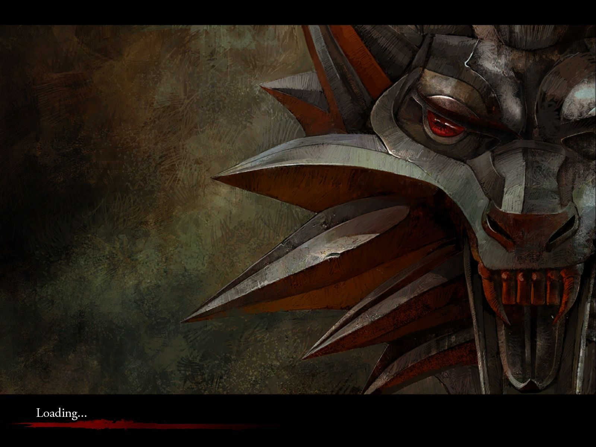

# Barganha

**Disciplina**: FGA0210 - PARADIGMAS DE PROGRAMAÇÃO - T01 <br>
**Nro do Grupo (de acordo com a Planilha de Divisão dos Grupos)**: 02<br>
**Paradigma**: SMA<br>

## Alunos

| Matrícula  | Aluno                             |
| ---------- | --------------------------------- |
| 19/0041871 | Abner Filipe Cunha Ribeiro        |
| 19/0102390 | André Macedo Rodrigues Alves      |
| 19/0012307 | Eduardo Afonso Dutra Silva        |
| 18/0018728 | Igor Batista Paiva                |
| 18/0033620 | João Henrique Cunha Paulino       |
| 16/0152615 | João Pedro Elias de Moura         |
| 18/0054554 | Paulo Batista                     |
| 19/0019158 | Rafael Leão Teixeira de Magalhães |
| 19/0020903 | Vitor Magalhães Lamego            |

## Sobre

### Contextualização

Em 2048 a União das Repúblicas Socialistas da América Latina (URSAL) e os
Estados Unidos da América (EUA) entraram em conflito, devido a
divergências ideológicas de sistemas econômicos. O conflito ficou
conhecido como **guerra dos roteadores**, dado que os principais alvos de
ataque foram as redes de computadores destes países.

Os ataques constantes às redes destes países causou uma
crise no gerenciamento de alimentos, combustíveis, medicamentos e itens
básicos para a sobrevivência humana. Após as agressões nas redes de
telecomunicações, as armas nucleares começaram a ser usadas
por ambos os lados, no intuito de reduzir o tempo do conflito. O que
acabou com 78% da população humana, e obrigou a parte que
restou a viver em bunkers.


### Engenharia de Quintal

E é neste cenário apocalíptico que os estudantes da Universidade Nacional
da Bahia (UnB): Moisés, Maria, Edmilson e Edlaine estão se formando no
curso de Engenharia de Software. A comunidade científica ainda possuia
um restrito acesso à internet, através das redes federadas que conectavam
os principais centros de pesquisa da América Latina.

Os estudantes da UnB possuiam uma cota de 500 mega bits por mês de tráfego
de dados que poderiam ser usados para fins recreativos. Os estudantes
citados, em uma de suas reuniões da Empresa Júnior
**Engenharia de Quintal**, decidiram juntar suas cotas de internet para
baixar o jogo The Witcher 1, no intuito de estudar o comportamento dos
**algoritmos de barganha** implementados nos 'bruxos' para compra de livros
que os auxiliariam na criação de poções, óleos, bombas, armas, etc.
Itens quais auxiliam os 'bruxos' em seus trabalhos.

O grupo **Engenharia de Quintal** tinha muito interesse neste algoritmo
de Sistemas Multi Agentes (SMA), que havia sido implementado em C98. Dado
que se eles conseguissem extrair este código do jogo e adaptassem ele para
compradores e vendedores de livros científicos, a Universidade teria
vantagem na negociação de livros com outros institutos
de pesquisa.


### Sobre The Witcher 1

A história de "The Witcher 1" segue o personagem Geralt de Rivia, um
caçador de monstros conhecido como "bruxo", em sua jornada para encontrar
sua identidade e destino enquanto enfrenta perigos políticos e mágicos em
um mundo de fantasia. A aventura envolve escolhas morais difíceis e se
desenrola em um contexto de guerra civil, conspiração e ameaças
sobrenaturais.

A jogabilidade de "The Witcher 1" é baseada em RPG, com elementos de ação,
aventura e decisões morais. O jogador controla Geralt em suas missões e
explorações pelo mundo, realizando tarefas, lutando contra inimigos e
tomando decisões que afetam o enredo e o resultado da história. Há um
sistema de combate dinâmico, alquimia, upgrade de habilidades, escolhas de
diálogo e um sistema de escolha de romance. O jogo se desenvolve ao longo
da escolha de missões e decisões do jogador, com resultados que
influenciam a história e o relacionamento com personagens secundários.

Em "The Witcher 1", comprar livros pode ser útil por vários motivos:

- Aumentar o conhecimento do mundo: os livros oferecem informações sobre a história, cultura, bestas e pessoas do mundo de fantasia, ampliando a compreensão do jogador do contexto em que a história se desenvolve.

- Desbloquear habilidades: alguns livros podem ensinar novas habilidades e técnicas a Geralt, melhorando suas habilidades de combate e magia.

- Completar missões: algumas missões exigem informações específicas que só podem ser obtidas através da leitura de livros.

- Aumentar a imersão: os livros fornecem uma camada adicional de profundidade e detalhes para o mundo e a história, ajudando a criar uma sensação mais imersiva de jogo.



### Os resultados obtidos até agora

Moisés e Maria, a dupla <s>espanca código</s> especializada em engenharia
reversa, conseguiu extrair uma parte do código de **barganha**, e traduziu
em pseudo código para que os programadores, Edmilson e Edlaine,
reescrevam as adaptações, que estão na pasta [src](src/), das regras
de negócio do jogo para a realidade da UnB.

Pseudo código:

```
Barganha:
# Estruturas
    Vendedor:
		preco_inicial
		preco_minimo
	Bruxo:
        valor_pago_max
	Livro:
        Qualidade (NOVO := 3, SEMINOVO := 2, USADO := 1)


# Lógica dos agentes
	Se preco_minimo > valor_pago_max:
		Bruxo não compra.

	Se qualidade < qualidade_desejada:
		Bruxo não compra.

```

## Screenshots

Adicione 2 ou mais screenshots do projeto em termos de interface e/ou funcionamento.

Buyer Agent:


Seller Agent:


Gui Agent:


## Instalação

**Linguagens**: Java<br>
**Tecnologias**: Jade<br>

Para rodar este projeto, será necessário ter o java e os binários do jade instalados em sua
máquina.

Instalação do java:

```
sudo apt install default-jre
```

Instalação do jade:

Entre no site do Jade (https://jade.tilab.com/download/jade/license/jade-download/?x=32&y=11) e instale um dos arquivos que contenha os binários .jar do Jade.

## Uso

Explique como usar seu projeto.
Procure ilustrar em passos, com apoio de telas do software, seja com base na interface gráfica, seja com base no terminal.
Nessa seção, deve-se revelar de forma clara sobre o funcionamento do software.

## Vídeo

Adicione 1 ou mais vídeos com a execução do projeto.
Procure:
(i) Introduzir o projeto;
(ii) Mostrar passo a passo o código, explicando-o, e deixando claro o que é de terceiros, e o que é contribuição real da equipe;
(iii) Apresentar particularidades do Paradigma, da Linguagem, e das Tecnologias, e
(iV) Apresentar lições aprendidas, contribuições, pendências, e ideias para trabalhos futuros.
OBS: TODOS DEVEM PARTICIPAR, CONFERINDO PONTOS DE VISTA.
TEMPO: +/- 15min

## Participações

Apresente, brevemente, como cada membro do grupo contribuiu para o projeto.
|Nome do Membro | Contribuição | Significância da Contribuição para o Projeto (Excelente/Boa/Regular/Ruim/Nula) |
| -- | -- | -- |

## Outros

| André Macedo Rodrigues Alves | Minha contribuição para o trabalho foi inicialmente a possibilidade de passar a proposta como parâmetro do agente e um novo agente Thief. Contribui também com a documentação do trabalho. | Boa |

Quaisquer outras informações sobre o projeto podem ser descritas aqui. Não esqueça, entretanto, de informar sobre:
(i) Lições Aprendidas;
(ii) Percepções;
(iii) Contribuições e Fragilidades, e
(iV) Trabalhos Futuros.

## Fontes

Site oficial do Jade: https://jade.tilab.com/
Tutorial de Jade com o exemplo do "Book trading": https://jade.tilab.com/doc/tutorials/JADEProgramming-Tutorial-for-beginners.pdf
